# Elements common to all control tasks

&nbsp;&nbsp;&nbsp;In this section, we're going to learn the basic concepts of reinforcement learning and from them, we are going to develop a general template common to all control tasks. From this template in the following sections will be able to develop methods to deal with these tasks.  
&nbsp;&nbsp;&nbsp;The first element common to all control tasks is the state at the moment in time. The state is all the relevant information that describes which situation the task environment is currently in.  
In the case of chess, the state of the game consists of the location of the pieces on the board and the remaining time. In the case of the robotic arm, the state is the position of the object to be manipulated and the rotation of the arm joins. In the case of the Pacman video game. The state is the position of our avatar, the position of the yellow pills and the position of the ghosts in the maze. The state is always linked to a moment in time. That is, we refer to the state at time t.  

&nbsp;&nbsp;&nbsp;The next element that we find in all control tasks are the actions that are carried out during the task. The actions are the moves that the player can perform at every moment in time. In the case of the mechanical arm. The actions consist of modifying the rotation of the joints to pick up and move the object. In the case of Pacman, the actions consist of the buttons the player presses on the controller to move the avatar. Actions are also tied to a moment in time. And they are chosen based on the state of the task. By that, we mean that the agent observes the state and based on the characteristics of the state in which the task finds itself, it will take some actions on others.

&nbsp;&nbsp;&nbsp;Third, when working with a control task, we need some mechanism that informs the agent about the effectiveness of its decision making. That mechanism is the rewards. A reward is a numerical value that the agent receives after carrying out an action. And it determines the immediate effect of having carried out that action. In chess the goal is to win the game. Therefore, when the player carries out a move that checkmates the opponent, the task must give it a positive reward. When it carries out a move after which the opponent will checkmate it, the task should give it a negative reward. And if the move doesn't end the game, the reward should be zero. In the case of the robotic arm, the rewards should be zero until the robot manages to move the object correctly, and only then upon reaching its goal, should it receive a positive reward from the environment. Finally, in the Pacman game, every time that the agent eats a yellow pill, it should be rewarded positively. These rewards are a representation of the task goals in the form of feedback. So the greater the rewards we get, the better we are achieving the goals of the task.

&nbsp;&nbsp;&nbsp;The fourth element common to all control tasks is the agent. The agent is the entity that will participate in the task by observing its state and carrying out actions at each moment in time. In all three cases, the agent can be a human being who observes the state of the task with his eyes and takes the necessary actions based on it. But since this is a course on reinforcement learning, our agents will always be the algorithms that carry out these actions.

&nbsp;&nbsp;&nbsp;Finally, the last element is the environment, which comprises all of the aspects of the task that the agent doesn't control 100%. For example, in the case of chess, the remaining time is part of the environment because the agent cannot decide to increase it arbitrarily. Also, the opponent's moves are part of the environment, since the agent does not control which moves its opponent makes. In the case of the robotic arm, all physical aspects are part of the environment. For example, the agent cannot modify the force of gravity nor the friction of objects. In the case of Pacman, the movement of the enemies are part of the environment as well as the shape of the maze and the location of the pills.

# The Markov decision process (MDP)

&nbsp;&nbsp;&nbsp;In this video, we are going to take the five elements that we saw in the previous video and use them to create a template that describes all control tasks. That template is known as the `Markov decision process`.  
Well, it's a discrete time stochastic control process. It is a control process because it's based on decision making to achieve the goals of the task. It is a stochastic process because the agent's actions affect only partially the evolution of the task. And finally, it's a discrete time process because in the tasks that we are going to represent with this template, time progresses in finite intervals. That is t=1, t=2, and so on.

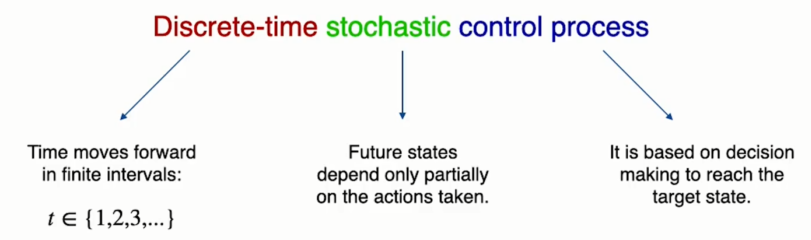

&nbsp;&nbsp;&nbsp;Here's a diagram representing the Markov decision process. In this process, the agent interacts with the environment. At the start of the task, the agent observes the initial state of the task and based on it, it takes an action. This action produces an effect on the environment which modifies its state. As a result, the agent observes again the new state in which the task finds itself and receives a reward from the environment, which gives feedback on the effect that the previous action had on the environment. Then, based on the new state, the agent takes another action and the cycle repeats itself until the task ends, either because the agent has achieved the goal of the task or because it has failed for some reason.

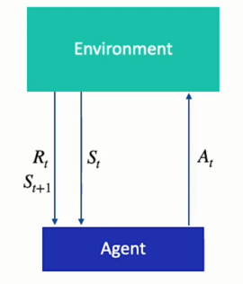

&nbsp;&nbsp;&nbsp;Thanks to the Markov decision process, we can analyze very different tasks using the same concepts. An additional advantage is that we can describe a control task in a very simple way based on four objects.  
The first object is the state space, which consists of all the possible states in which the task can find itself.  
The second is the action space, which consists of the set of all the actions that the agent can execute in the environment.  
The third object is the set of all rewards obtained by performing each action in each state.  
And the last object is the set of probabilities of changing from one state to another by taking an action.  
If we know these four elements, we can perfectly describe a control task. And we can use the same structure to analyze different tasks simply by modifying the content of each of these elements.  
&nbsp;&nbsp;&nbsp;To give an example, in the game of chess, the state space consists of all the valid configurations of the board and all the possible values for the remaining time. The action space consists of all the valid moves in each state of the board. The set of rewards consists of the rewards obtained by taking each action in a valid state, and finally, the set of transitions consists of the probabilities of reaching each successor state by moving a piece.

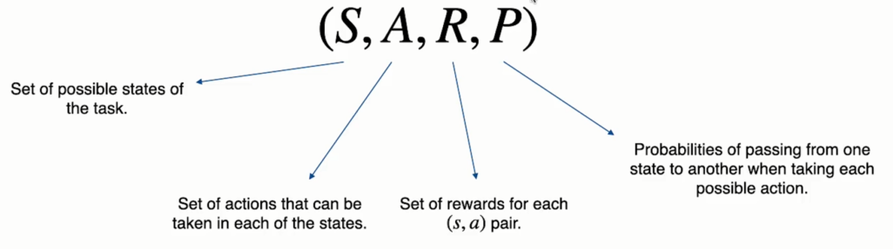

&nbsp;&nbsp;&nbsp;These Markov decision processes have an important property, and that property is that the next state visited depends only on the current state and not on the previous ones. That is the process that we have followed to reach the current state does not influence the future states that we will see.

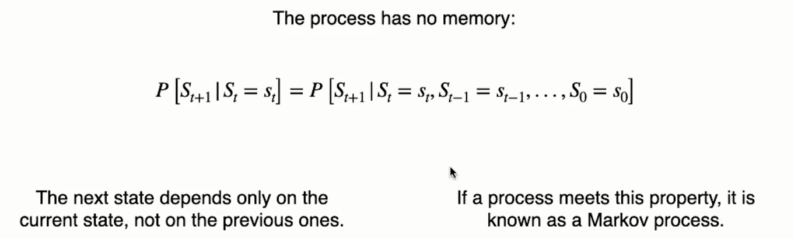

&nbsp;&nbsp;&nbsp;In fact, the Markov decision process is an extension of a process known as a Markov chain. In this chain the process starts in a particular state S0 and at each moment in time it has a probability of changing states to S1, and that probability is 70% and also with 30% probability it will remain in state S0. The Markov decision process is a similar kind of process that incorporates actions and rewards. In this example, the process starts in the state S0 and the agent must take an action, either A0 or A1, and based on a set of probabilities, can either change its state to S1 or remain in S0.

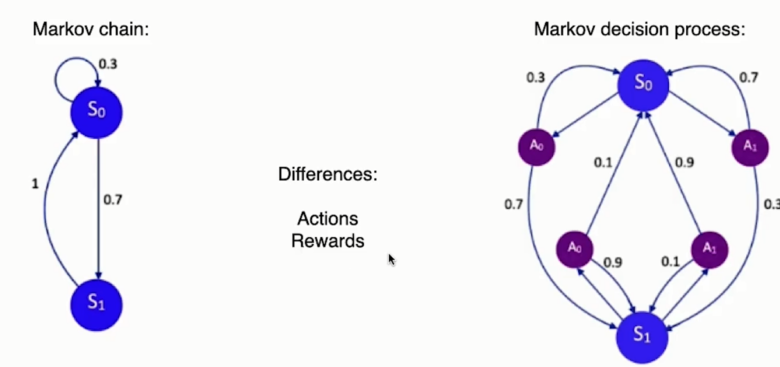

# Types of Markov decision process

&nbsp;&nbsp;&nbsp;In this video, we're going to see the different types of Markov decision process that exist. The first way in which we can classify them is by distinguishing between `finite` and `infinite` Markov decision processes.  
In a finite Markov decision process, both the number of states, the number of actions and the number of rewards are finite.  
In an infinite Markov decision process, one or more of these three values is infinite.  
&nbsp;&nbsp;&nbsp;For example, this task (the 5x5 maze), is a finite Markov decision process because the state consists of the agent's location and there's only 25 possibilities. It also has only four possible actions at any given state and a single reward for each action in each state. An example of an infinite Markov decision process, may be the task of driving a car. in this task, the state is the position of the car and its speed, and both values are continuous.  

&nbsp;&nbsp;&nbsp;Moreover, we can distinguish between `episodic` and `continuing` Markov decision processes.  
An episodic process terminates under certain conditions. For example, in the case of chess, the task ends when the player or its opponent gives checkmate.  
Conversely, a continuing Markov decision process does not have a termination condition. It simply keeps going.

# Trajectory vs episode

&nbsp;&nbsp;&nbsp;A `trajectory` is the trace generated when the agent moves from one state to another. For example, in the case of the maze, the agent moves from the state over here to this state over here in three steps. The trajectory denoted by the Greek letter tau is the sequence of elements that is generated through this process. At the beginning of the trajectory, the agent is in state S0. Then based on the state, it will take the action A0, and consequently it will obtain the first reward. Then in state S1, it will take action A1 and this chain will continue until it reaches the final state of the trajectory.  

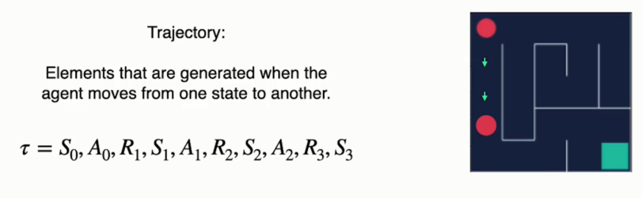

&nbsp;&nbsp;&nbsp;On the other hand, an `episode` is simply a `trajectory` that starts in the initial state and ends in the final state.  

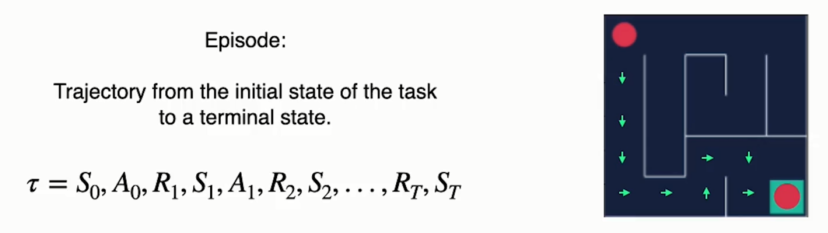

# Reward vs Return

&nbsp;&nbsp;&nbsp;Remember that we said that the goals of the task are represented by the rewards that the environment gives the agent in response to its actions. So in order to solve the task in the best way possible, we want to maximize the sum of those rewards. However, there are situations in which taking an action to obtain a short term reward can worsen the rewards that we obtain in the long run.  
&nbsp;&nbsp;&nbsp;For example, in chess, capturing an enemy piece can cause us to lose an important position and make it easier for the opponent to beat us.

&nbsp;&nbsp;&nbsp;For that reason, we have to qualify what we want to achieve. We want to maximize the long term sum of rewards.  
Now, let's look at the difference between the reward and a return. Reward is the immediate result that our actions produce. On the other hand, the return is the sum of rewards that the agent obtains from a certain point in time (t) the until the task is completed. That is the return is the long term result of the actions that we take during the episode. Since we wanted to maximize the long term sum of rewards, we can also say that we want to maximize the expected return.

# Discount factor

&nbsp;&nbsp;&nbsp;Take a look at this control task. It's a 5x5 maze in which the agent (the red circle) has to find the exit, which is the green square at the lower right corner.  

&nbsp;&nbsp;&nbsp;After executing each action, it will receive a reward of 0 except when it reaches the exit, when it will receive a positive reward of +1. The shortest path is the one you see on the screen. If it follows it, the agent will reach the goal in 10 steps and it will get a return of +1. However, if the agent wanders around in this part of the maze and then returns to the correct path until it reaches the goal, it will also get a return of +1. In the first case, it has solved the task efficiently and in the second one, much more slowly. The way we have designed the rewards, the agent has no incentive to find a way out as quickly as possible, although obviously that is what we want it to achieve. To do that, we have to modify somehow the return in a way that it rewards the most efficient behaviors.

&nbsp;&nbsp;&nbsp;And we can do that by multiplying future rewards by a discount factor. When we calculate the return. Here you see the return at time zero. That is the sum of rewards from the time the task begins until it finishes. And in calculating this return, we multiply each future reward by gamma raised to the power of the moment in time when that reward was received minus one. Gamma is a value between zero and one, so by multiplying it, it reduces the values of the rewards obtained in the future. The higher the exponent, the more the value of the reward is reduced. That way, the first reward has its full value. The next one is discounted by gamma, the next one is discounted twice by gamma and so on and so forth until the end of the episode. The longer it takes us to achieve a specific reward. The more we reduce its value when calculating the return, that way, the agent has an incentive to get them as soon as possible.

&nbsp;&nbsp;&nbsp;Now, let's see what happens when we give extreme values to the discount factor, if gamma = 0, all future rewards except for the first one will be worth 0. Thus, the agent has an incentive to take the actions that bring it an immediate reward. That is, it will make completely myopic decisions without taking into account the future consequences of its actions.  
On the contrary, if gamma equals one, we will be giving the agent more patience to formulate its long term strategy.
In practice, intermediate values are often used. In many tasks, the default value of `0.99` is used because it introduces that incentive to get the rewards as soon as possible. But it also allows the agent to keep a long term view. In short, gamma measures how far into the future the agent can look when planning its actions. And now with this incentive that we have incorporated into our definition of return, we can change the goal of the control task. We want to maximize the long term discounted sum of rewards.

# Policy

&nbsp;&nbsp;&nbsp;We're going to find out what the agent's policy is. It is one of the central concepts of reinforcement learning, since in all our algorithms, we will look for the optimal policy. The policy is a function that takes as input a state and returns the action to be taken in that state. It is represented by the Greek letter `pi`.

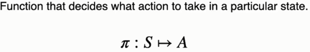

&nbsp;&nbsp;&nbsp;In the course, you're going to see the policy in these two situations. The expression on the left represents the probability of taking action "a" in a given state "s". The expression on the right represents the action that the policy chooses in state "s". Depending on the context and what we want to express, we will use one expression or the other.

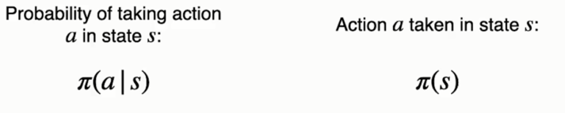

&nbsp;&nbsp;&nbsp;Policies can be `stochastic` or `deterministic`. Policies can be stochastic or deterministic. A deterministic policy always chooses the same action in a given state. A stochastic policy chooses the action based on certain probabilities. In the example below, the policy has a 30% chance of choosing the first action, a 20% chance of choosing the second and a 50% chance of choosing the third. 

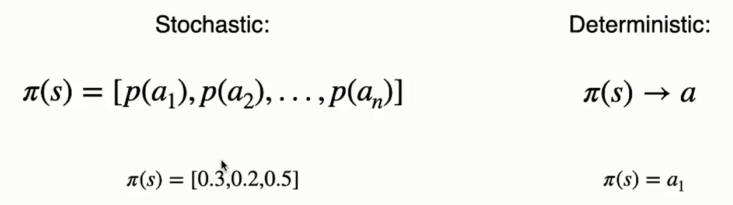

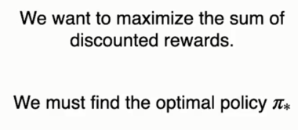

# State values v(s) and action values q(s,a)

&nbsp;&nbsp;&nbsp;In this video, we're going to discover a way to evaluate the different states and actions of a task. The value of a state will be defined as the return that we expect to obtain starting from that state and interacting with the environment following policy pi until the end of the episode. The value of a state is linked to the policy that we decide to follow, since different policies take different actions and will achieve different returns.

&nbsp;&nbsp;&nbsp;On the other hand, we can also evaluate an action in a particular state, and we'll do that by means of the q-value. The q-value of an action in a state is the return that we expect to obtain if we start in state "s" we take action "a" and then we interact with the environment following policy pi until the end of the episode. We'll use this q-values extensively because they simplify the search for the optimal policy in many algorithms.

# Bellman equations

&nbsp;&nbsp;&nbsp;We're going to discover the bellman equations, which will be of vital importance when searching for the optimal policy to solve control tasks.  
This one here is the `Bellman equation` for the `value of a state.  
Starting from the definition of the value of a state which we know is the expected return following policy pi from this state, we can expand the definition of the return to arrive at the second expression.If you notice, this expression, starting at the second term is equal to the return starting from the next moment in time, discounted by gamma. And thus we arrive at the third formula. Finally to get to the fourth expression, remember that the value of a state is the expected return. This mathematical expectation can be written as the probability of taking each action following that policy multiplied by the return we expect to get from taking that action. And that return can be expressed as the probability. Of reaching each possible successor state multiplied by the reward obtained upon reaching that state, plus the discounted value of that successor state. Notice that we have discovered a recursive relationship between the value of one state and the values of other states.  

&nbsp;&nbsp;&nbsp;The same process can be followed for the q-values, starting from its definition, that is the expected return from taking action a and then following policy pi. We can expand the definition of the return to arrive at the second formula. Then we can transform all these terms into the discounted return starting at the next moment in time, as we did for the values of the states, and we can arrive at this expression. Finally, we can rewrite the expected return as the probability of reaching each successor state knowing that we have chosen action a multiplied by the first reward obtained upon reaching that successor state, plus the discounted sum of the q-values use of each action in the successor state, weighted by the probability of choosing that action by the policy. In this way, we have managed to express a q-value in terms of other q-values.

# Solving a Markov decision process

&nbsp;&nbsp;&nbsp;We are going to see in a general way what it means to find a solution to a Markov decision process. Remember, that solving a control task consist of maximizing the expected return. The value of a state is precisely that expected return, so solving a task involves maximizing the value of every state. Or maximizing every q-value. To maximize those returns.  
&nbsp;&nbsp;&nbsp;We have to find the optimal policy, which is the policy that takes the optimal actions in all states. On the other hand, the optimal policy is precisely defined as the policy that in each state chooses the action that leads to the maximum expected return. Using the value of the states will take into account the states to which the action leads and the return that we expect to obtain in that successor state. Using the q-values we will simply select the action whose q-value is highest.  

&nbsp;&nbsp;&nbsp;But we seem to have a problem: to find the optimal policy, we have to know the optimal values and to find the optimal values, we have to know the optimal policy.  
How can we find these two elements if one depends on the other. For that, let's revisit the Bellman equations and see what condition must hold when the policy and the value functions are optimal.  

&nbsp;&nbsp;&nbsp;Let's start with the Bellman optimality equation for the value of the states. The optimal value of a state is the expected return following the optimal policy. The optimal policy will always choose the action that maximizes the expected return and the expected return is this expression here :  
The probability of reaching each successor state by taking the optimal action multiplied by the reward achieved by reaching that state, plus the discounted optimal value of that state. In turn, the optimal q-value for an action in a state is the weighted sum of the returns obtained upon reaching each of the possible successor states. Weighted by the probability of reaching that successor state. The return is the expression you see here. Defined as the reward achieved upon reaching the successor state plus the maximum q-value among the actions Defined as the reward achieved upon reaching the successor state plus the maximum q-value among the actions

https://colab.research.google.com/github/escape-velocity-labs/beginner_master_rl/blob/main/MDP_introduction.ipynb#scrollTo=Klag2liexhB8

 

