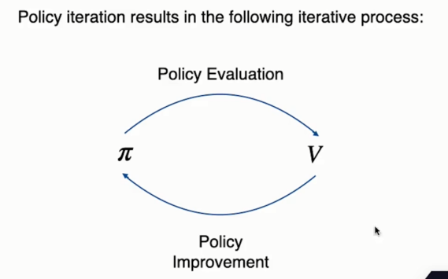
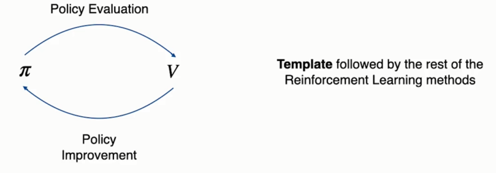
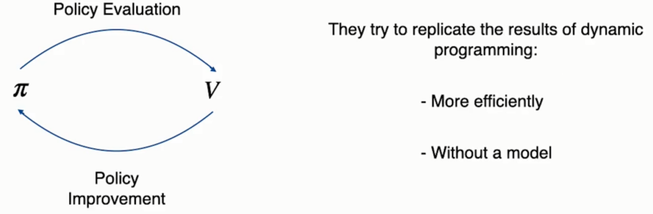
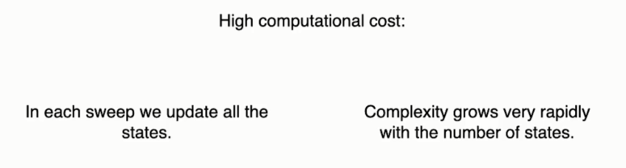

# Introduction to Dynamic Programming

&nbsp;&nbsp;&nbsp;We're going to discover the first family of methods capable of solving control tasks. They are known as dynamic programming. These methods find the solution to problems by breaking them down into smaller problems that are easier to solve. In our case, as you know, the problem that we are trying to solve is finding the optimal policy. 

&nbsp;&nbsp;&nbsp;For us to be able to apply dynamic programming to a problem it has to have two properties.  
The first one is an optimal substructure. What this means is that in finding the solution to each of its sub problems and joining those individual solutions, we will have found the optimal solution to the original problem.

&nbsp;&nbsp;&nbsp;We want to find the optimal policy. That policy picks the action that maximizes the expected return in every single state. We can divide this task into finding the optimal policy for every state individually if we find the optimal policy for each of the states we'll have obtained the optimal policy for the entire problem.

&nbsp;&nbsp;&nbsp;We can guide and structure the search for this policy using value functions. The optimal policy We can guide and structure the search for this policy using value functions. The optimal policy We can guide and structure the search for this policy using value functions. The optimal policy If we find the optimal value for each state independently, then we'll have the optimal value function for the overall problem. So as you see, the problems that we want to solve do have an optimal substructure.

&nbsp;&nbsp;&nbsp;The second property is to contain overlapping sub problems. Let's call the overall problem to be solved problem P. We can decompose P into a set of subproblems. The solution to each of these subproblems must be dependent on the solution to other subproblems. For example, the optimal solution to the problem A will be dependent on problem B and the solution to problem B will be dependent on both problem A and problem C. In other words, the solutions are mutually dependent on each other. Now we wonder if this feature is present in the problems that we'll try to solve.

&nbsp;&nbsp;&nbsp;Well, if you remember the Bellman equations, you'll know that this is also true. These equations expressed the value of a state in terms of the values of other states or in the case of the q-function, the value of an action in a state as a function of the value of other actions in other states. So as you can see, the problems that we'll try to solve do satisfy the second requirement.

&nbsp;&nbsp;&nbsp;So what does dynamic programming exactly do?  
We'll keep a value table with an entry for each state. And in that table, we are going to maintain an estimate of the value of each state. That estimate at the beginning doesn't have to be accurate, but we are going to improve it in an iterative fashion. To do that, we are going to convert the Bellman equation that you see here into an update rule. And with it, we are going to sweep the state space and update the estimated value of each state according to the right hand side expression. Each time we update the estimated value of a state, we'll have better estimates for the related values. And therefore, the new estimate will be more accurate than the old one.

&nbsp;&nbsp;&nbsp;However, we have a problem. To perform the update, we need to know in advance the state transition probabilities, that is, we need to know in advance what states might follow after we choose an action and with what probability. One big limitation of dynamic programming is that it needs a perfect model of the environment. That is, we need access to these state transition probabilities. An example of a task where we have such a model is the Rubik's Cube. We know what the cube will look like after we rotate it along one of its axis. However, in a large number of tasks, that model won't be available and we'll have to use other the algorithms to solve them. One last important thing about dynamic programming is that it solves problems using expected values, it takes into account every possible outcome of taking an action and uses it to update the estimated values. In contrast, the methods that we'll see starting in the next section won't have a model of the environment dynamics available, and they'll use experience samples collected by the agent interacting with the environment to update the estimated values.

# Value iteration

&nbsp;&nbsp;&nbsp;We're going to see our first dynamic programming algorithm called `value Iteration`. We want to find the optimal policy. This policy is the one that in each state takes the action that maximizes the return. To compute the expected return in order to choose the action, we must know the optimal value of the states that may follow the present state. We estimate these values following an iterative process.

&nbsp;&nbsp;&nbsp;We'll keep a table with the estimated values of each state. The initial estimate doesn't have to be good. Then we'll go state by state improving these estimates according to this rule. We'll repeat this process as many times as necessary until we estimates are very close to the values under the optimal policy.

&nbsp;&nbsp;&nbsp;Here's the algorithm, as you can see, it's quite simple, we'll just repeat a loop where will update the estimated value of every state. At first, the values will change a lot between one update and the next. But as they approach the optimal value, they'll change less and less. When the changes are smaller than these theta parameter chosen by us, we will stop running the loop because the approximation will be good enough. Then, based on these estimates of the optimal values we will define the policy, choosing the actions that maximize the expected return.

&nbsp;&nbsp;&nbsp;Let's see it with an example. On the right, we have a control task that we saw in the previous section: the 5x5 maze.  
After every move, the agent gets a reward of -1. The goal is to find the exit through the shortest path. This environment is deterministic, which means that if the agent moves to the right, it will end up on the cell at its right with the probability of 100%, unless there is a wall in between. At the beginning of the algorithm, we estimate the values of all states as 0, although we could have chosen any other value. Then will iterate through all the states that are not the goal state updating their value according to the formula below.

&nbsp;&nbsp;&nbsp;After the first iteration, the value table will look like this. All rewards are -1 after performing any action and the estimate of the next day is 0 in all cases. So the new estimate, according to the rule below, will be negative one for all states except the goal. The two closest states to the goal, this and this. Have already reached their optimal value, if they take the optimal action, they'll reach the goal and get the reward of -1 and then the task is finished.

&nbsp;&nbsp;&nbsp;In the next iteration all states whose optimal values we haven't found yet, will continue to approach them.

&nbsp;&nbsp;&nbsp;And after each iteration, the process continues. And finally, after 18 iterations, we'll have found the optimal value of all states. As you can see, the further a state is from the goal, the lower its value. This is because the agent collects a negative reward every time it moves. So the more steps it needs to take, the more negative rewards it will collect.

https://colab.research.google.com/github/escape-velocity-labs/beginner_master_rl/blob/main/Section_3_value_iteration_complete.ipynb

# Policy iteration

&nbsp;&nbsp;&nbsp;We're going to look at another dynamic programming algorithm called `policy iteration`. This algorithm is important for two reasons.  
First, because it will allow us to solve control tasks.
But besides that, it will serve as inspiration to design the vast majority of reinforcement learning algorithms that we are going to see.  
&nbsp;&nbsp;&nbsp;The algorithm finds the optimal policy and its value function by alternating two processes. We will initialize the policy and the value function with arbitrary values and then we will start by evaluating the policy. That is, we will make the value function that we have reflect the values of each state following the present policy. Then we will change the policy to a better one using the value function that we just produced.  
&nbsp;&nbsp;&nbsp;After that, we'll keep repeating these two processes in an alternating fashion and both the value function and the policy will approach the optimum. As you can see, these two processes are in competition with each other, but they also collaborate, pushing each other to the optimal solution.

&nbsp;&nbsp;&nbsp;Here's the complete algorithm. It looks a bit complex, but it's actually very simple. We start with an arbitrary policy and value function. And then we'll repeat this loop, as long as the policy keeps changing. We will stop only when it's already optimal and therefore doesn't change. The first part of this loop is the policy evaluation process, where we will modify the value function to reflect the present policy's state values. And the second part is where we improve the policy based on the state value function. As you can see, each of these parts is one of the processes In the previous diagram.

# Policy evaluation

&nbsp;&nbsp;&nbsp;We're going to see in more detail the first part of the policy iteration algorithm in which we evaluate the policy. If you recall, in the previous section of the course, we explained that the value of a state following a given policy is the return that we expect to obtain by starting from that state and taking actions according to that policy. This can be expressed with the first formula that you see here, it's the probability of taking each action under the policy times, the probability of that action, taking us to a specific successor state. Times the reward obtained after reaching that next state, plus the discounted value of that next date.  
&nbsp;&nbsp;&nbsp;Therefore, it is the weighted sum of possible outcomes using that policy. This formula is known as the `Bellman equation`. Well, policy evaluation consists of finding these values for the policy that we have at a given moment. To do this, we are going to follow a process similar to the one we saw in the value iteration algorithm. We will sweep the state space, updating the estimate of each value with the update rule that you see below.

&nbsp;&nbsp;&nbsp;This is the part of the policy iteration algorithm where we carry out this process. As you can see, it is almost identical to the value iteration algorithm that we implemented earlier. The only thing that's different is the update rule. In value iteration, we updated the state values using the action that maximized the return. In this case, we do it according to the probabilities that the policy assigns to each action.

&nbsp;&nbsp;&nbsp;After each sweep of the state space, the estimates will be closer to the state values. We'll stop when we consider that the estimates are close enough.

# Policy Improvement

&nbsp;&nbsp;&nbsp;We're going to see the second part of the policy iteration algorithm, where we will improve the present policy using the state value function that we just obtained in the previous step. To improve the policy, we'll ask ourselves the following question :   
would the policy improve if we change the action chosen in the present state? In other words, which is better to follow the policy as it is now, or to change the action that we take in this state and then follow the policy as it is?  
&nbsp;&nbsp;&nbsp;To answer this question, we're going to use the q-value function, which evaluates the expected return if in the current state, we take a given action and then we follow the policy. As you see in the formula, it's the sum of probabilities of arriving at a specific next state after executing that action times the reward obtained when we arrive at that successor state, plus the discounted value of that state. Each section will have a different q-value in this state.

&nbsp;&nbsp;&nbsp;Then we'll compare those q-values to the value of the present state. And if one of those q-values is greater than the value of the state we will modify the policy to take that action and the resulting policy will be called pi prime. This new policy is identical to the former policy pi except that in the present state, it will take the action with the highest value. Thanks to a result known as the Policy Improvement Theorem, we know that if the q-value of the action selected by pi prime is higher than the value of the state under pi, then pi prime will be better than pi, because the present state It will have a higher value and in all other states it will be identical to pi.

&nbsp;&nbsp;&nbsp;If we repeat this process with every state, then we'll get a better policy than the one we had before. And it will take the best actions based on the current estimates of the values.

&nbsp;&nbsp;&nbsp;This is the piece of code where policy improvement is implemented. As you can see, it will iterate through each state checking if there's a better action to change the policy to. If it changes, at least the action in one state, then will change the value of the policy stable variable to false and we'll go back to the policy evaluation part. If the policy doesn't change, that means we found the optimal policy and the algorithm will terminate.

https://colab.research.google.com/github/escape-velocity-labs/beginner_master_rl/blob/main/Section_3_policy_iteration_complete.ipynb#scrollTo=U_8oUWxl6Vbh

# Policy iteration in practice

&nbsp;&nbsp;&nbsp;We'll see what the policy iteration algorithm looks like in practice. Remember that the algorithm is divided in two parts :  
`policy evaluation` (where we make the value will reflect the values of the present policy)  
and `policy improvement` (where we use the values to modify the policy).  
&nbsp;&nbsp;&nbsp;Let's see the results of these two alternating processes. We start with a random policy and a value table that estimates the values of all states as 0. Then after performing the first iteration of policy evaluation. The table looks like this. This is the value function of the random policy that we use to perform the task, as you can see, the values are very negative. The reason for that is that the random policy starting in any state will take a long time to reach the goal because the actions that it takes are random. Therefore, we can expect it to collect a large number of negative rewards before accidentally finding the exit.

&nbsp;&nbsp;&nbsp;Once policy evaluation is complete, policy improvement must be executed. This is the resulting policy after this process completes. As you can see, it's already the optimal policy. Why is that?  
The reason is because although the value estimates reflected that about policy.

&nbsp;&nbsp;&nbsp;We can still see that from states closer to the goal, the random agent finds the exit sooner and therefore the policy rightfully assumes that those states were better.

&nbsp;&nbsp;&nbsp;Then, since we have changed the policy, we have to execute another loop of policy evaluation. And after executing this loop, the table will reflect the values of the optimal policy. After this, another round of policy improvement is executed, but since we already have the optimal policy, it won't change and the algorithm will end.

# Generalized Policy Iteration (GPI)

&nbsp;&nbsp;&nbsp;We're going to discover the general template that most reinforcement learning algorithms will follow called `generalised policy iteration (GPI)`. The policy iteration algorithm leads to this iterative process in which policy evaluation alternates with policy improvement.  
Starting from the next section, the algorithms we are going to learn won't have a model and they will have to interact with the environment, trying to solve the task by trial and error. However, they'll still follow in their own way these two alternating processes. The difference is that the value updates will be made using experience collected from the environment.

&nbsp;&nbsp;&nbsp;That's why we say that this process will serve as a template for most reinforcement learning methods because all algorithms will follow it. The methods that we'll learn try to replicate the results obtained by dynamic programming, but in a more efficient way and without the need of a model of the environment dynamics.

&nbsp;&nbsp;&nbsp;Dynamic programming is not very practical for solving control tasks because of its limitations. On the one hand, it has a high computational cost. To solve a task, we have to update over and over again the estimated values of every single state. Real life control problems have a vast or even infinite number of states, and in these cases, dynamic programming simply won't work. Moreover, in most tasks, we won't have a perfect model of the environment with all state transitions. Most control tasks have many factors affecting their dynamics, some of them random. For situations like this, dynamic programming is simply not suitable. But if dynamic programming has so many drawbacks, why do we and study it? Well, because thanks to it, we have a strategy to design better algorithms.

 

