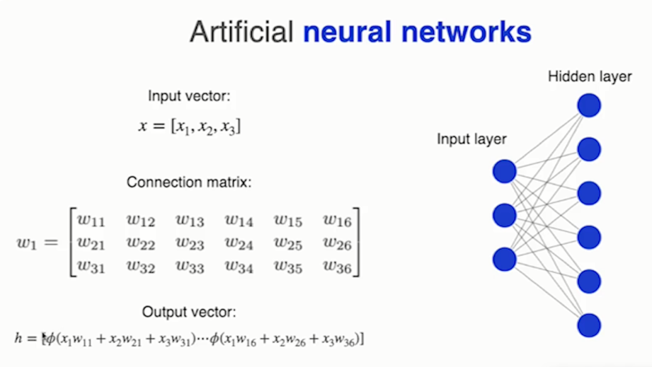
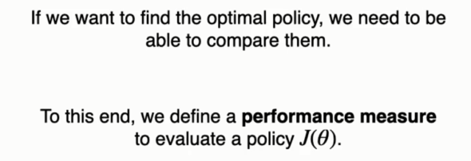
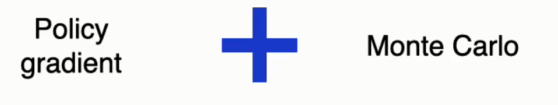

# Policy gradient methods

&nbsp;&nbsp;&nbsp;In this section, we are going to learn about a completely new family of algorithms. These are known as `policy gradient` methods. So far, all the algorithms that we have learned rely on estimates of Q values. The first family of algorithms that we knew use value tables in which the estimated Q values of each state and action pair are stored independently. But these methods, as we saw, have difficulties dealing with complex tasks when the number of states is large. To make these classical algorithms more flexible and powerful, we combine them with a tool called function approximators. Instead of keeping an independent estimate of each Q value, we maintain a function whose shape we modified during the learning process so that it would estimate the Q values as accurately as possible.

&nbsp;&nbsp;&nbsp;However, these two families have one thing in common. The policy takes into account the estimated Q values to perform the actions. For example, a greedy policy like the one you see here, looks at the value of the available actions in a state and chooses the action that we estimate will produce the highest return. The difference between these two family of methods is that in the first case we look up these values in a table and in the other they are produced by a neural network. Simply put, the policy is defined based on these values.

&nbsp;&nbsp;&nbsp;Now we are going to present a totally different family of algorithms known as policy gradient methods. In them we are going to use a function approximator not to estimate the Q values, but to estimate the probabilities of the policy taking each action.

&nbsp;&nbsp;&nbsp;And it will work as follows.  
We'll have a neural network that will take as input a state and based on that state it will generate a vector of probabilities with the probability of executing each of the actions. Of course, each of these values will be between 0 and 1. One means that the action has a 100% probability of being taken, and the sum of all the probabilities will be one.

&nbsp;&nbsp;&nbsp;Put another way in policy gradient methods, the neural network is the policy, and these are stochastic policies in which each action will have a probability associated with it. This family of algorithms will give us certain advantages.  
The first one is that value based methods are not effective in representing stochastic policies. Imagine a game in which the agent does not have all the necessary information about the task, such as poker. In games with imperfect information, it is possible that the optimal policy is, for example, to take one action with 70% probability and the other one only 30% of the time. However, value based methods are better suited to work with deterministic policies. Here's two examples. The first is a greedy policy that always chooses the action with the highest Q value. This policy is deterministic. On the other hand, we have an epsilon greedy policy in which the agent, every once in a while with probability epsilon, will take a random action. Although this policy is stochastic, it's more intended to explore the environment.

&nbsp;&nbsp;&nbsp;Another advantage of policy gradient methods is that with them the policy changes more smoothly during the learning process with value based methods. When the maximum Q value changes in a state from one action to another, the probability of taking the new action goes from 0 to 100%, and the opposite happens with the action that is no longer optimal. In contrast with policy gradient methods, the probabilities of taking an action gradually increase if the action turns out to be effective and gradually decrease if the action turns out to be not so good.

# Representing policies using neural networks

&nbsp;&nbsp;&nbsp;We're going to discover how to implement our policy using a neural network. But before that, let's do a brief overview of how neural networks work. If you remember, neural networks are composed of artificial neurons which take the input from the neurons to which they are connected.

&nbsp;&nbsp;&nbsp;They aggregate and transform that input before passing it to other neurons to obtain the values that a layer will propagate forward. We perform a vector matrix multiplication where the vector consists of the outputs of the previous layer of the neural network, and the matrix represents the intensity of the connections between neurons. The first column represents the connections of the first neuron. The second one represents the connections of the second and so on and so forth. To the result of this multiplication, we'll apply an activation function which transforms the values before propagating them to the next layer.

&nbsp;&nbsp;&nbsp;The neural network can be seen as a function where y is the output computed by the neural network. X is the input received through the input layer. And what happens when the neural network receives those inputs is that they will be multiplied through the matrix of connections to the first hidden layer. Then the activation function will be applied to the results of those operations and then the resulting vector will be multiplied by the connection matrix of the output layer. And then a final activation function will be applied before producing the resulting values as outputs. By changing the matrices of parameters W1 and W2, we can modify the neural network to approximate the function that we are interested in.

&nbsp;&nbsp;&nbsp;Encode The neural network looks like this. The first operation performs the matrix multiplication between the inputs and the hidden layer. The second operation transforms the results of the previous one, and the third operation multiplies the outputs of the hidden layer by the matrix of connections with the output layer. In the previous algorithms, the activation function of the output layer was the identity function, which means that the activation layer didn't apply any changes. That was so because we were computing Q values and Q values are not constricted to a specific range of values.

&nbsp;&nbsp;&nbsp;However, now the output of the neural network will be a vector of probabilities, so the output of each neuron in the output layer has to be a value between 0 and 1. And also the sum of the outputs must be one. That is so because all the probabilities must sum 100%. So now we are going to need an activation function in the output layer that will produce those results and that activation function will be the `softmax function`.

&nbsp;&nbsp;&nbsp;Here you can see its mathematical expression. The `Softmax function` will choose an action by amplifying the output of a neuron and inhibiting the output of the rest. To do that, we'll compute the value of each neuron as e raise to the value aggregated by that neuron divided by the sum of e raised to the aggregated value of each neuron. Here you can see it more clearly. The input is a vector with the aggregate values of each neuron and the output is the result of applying the `softmax function` to each of those aggregated values. And their sum, as we said, is one.

&nbsp;&nbsp;&nbsp;Graphically, the neurons of the output layer produce a vector of values. The `softmax function` increases the differences between those values and normalizes them.

&nbsp;&nbsp;&nbsp;And the result is a vector like the one you see here on the right. This is an example where the neural network chooses the second action, giving it the majority of the probability of being selected. The rest of the actions will retain a 1% probability of being chosen. This is another example in which the function assigns the greatest amount of probability to the first action, but also the second action will retain a 39% probability of being chosen.  

&nbsp;&nbsp;&nbsp;In summary, the `Softmax function` is the perfect tool for a neural network that needs to produce probability vectors.

# Policy performance

&nbsp;&nbsp;&nbsp;We are going to learn how to evaluate the performance of a policy implemented using a neural network. If we want to find the optimal policy, we need to be able to compare one policy to others so that we can choose the best one. And for that, we need some kind of measure that tells us what the performance of a policy is. Note that if we change the parameters of the neural network, it will produce different probability vectors for each state. That is, by changing the parameters of the neural network, we change the policy. Therefore, the performance of the policy is a function of its parameters.

&nbsp;&nbsp;&nbsp;And with this performance measure, we'll be able to express which policy we prefer. If the performance of one policy is higher than the performance of another one, then we'll prefer the first policy to the second one. 

&nbsp;&nbsp;&nbsp;And our goal, of course, is to find the optimal policy. That is, we want to find the policy with the highest possible performance. To do that, we'll have to find the values for the neural network parameters that produce this policy with optimal performance.

&nbsp;&nbsp;&nbsp;And that search is going to be carried out by gradient ascent. That is, we are going to use the experience that the agent collects from the environment to estimate the performance of the policy that gathered that experience.

&nbsp;&nbsp;&nbsp;And then when we obtain that performance estimate, we'll compute its gradient vector. Remember that the gradient vector contains the partial derivatives of the performance with respect to the parameters of the neural network. And this vector indicates how to modify these parameters so that the growth of performance is maximum. Once we have this vector, we'll use it to perform the stochastic gradient ascent update. In the update rule, we add to the previous value of the parameters the gradient of the performance measure. Alpha is the learning rate that will decide how big a step we are taking in the direction of the gradient.

# The policy gradient theorem

&nbsp;&nbsp;&nbsp;We already know how to optimize the policy using gradient descent. But in order to do that, we need to be able to estimate the performance of the policy from the experience that the agent collects, interacting with the environment. To know how to do that, we need to know the policy gradient theorem. This theorem is a result that tells us precisely what values we need to collect from the environment to be able to estimate the performance of the policy.

&nbsp;&nbsp;&nbsp;The first thing that we need to do is define exactly what we mean by performance. To do that, let's stop and think for a moment. What do we want to achieve when we perform a control task? Well, we want to take the actions that maximize the discounted sum of expected rewards. And that is the same as maximizing the value of the initial state. So we want to maximize the value of that initial state based on the policy that will follow starting in that state. That's going to be our definition of performance.

&nbsp;&nbsp;&nbsp;From that definition, we can arrive at the following result. To avoid complicating the explanation, we left out the derivation of this expression. But you can find it in this book. 

&nbsp;&nbsp;&nbsp;Let's explain step by step what this expression means. On the left hand side, we have the gradient of the policy's performance. This is the quantity that we want to approximate. The second term is the distribution of states following the policy. That is the percentage of times that we expect to see any given state out of the total. This third term, you already know it is the Q value of a state and action pair following the policy and this last term is the gradient of the probability of taking action A in state's. That is the direction in which we have to move the parameters of the policy, that is the parameters of the neural network so that the probability of choosing that action grows as much as possible. Okay. Once we know what each of these terms means, the question is what does this expression mean as a whole? Well, what it means is that the gradient of the performance of the policy is proportional to the return of each action in each state, multiplied by the gradient of the probability of taking that action in that state and weighted by the frequency with which we observe each state following that policy. Intuitively, if an action in a state produces a positive return to increase the return, we must increase the probability of picking that action. And if that action produces a negative return, the probability of choosing it must be reduced. Well, thanks to this expression, we can now improve the policy by using values that the agent can observe. We only need to obtain samples. Whose expected value is this expression? In this family of methods, there are many different algorithms and each of them does this differently.

# REINFORCE

&nbsp;&nbsp;&nbsp;We are going to discover the first method of the policy gradient family that we are going to implement. This algorithm is called reinforce. The algorithm is a combination between policy gradient methods and Monte Carlo methods. In it, the agent will face a task for a complete episode to collect experience, and at the end of the episode it will update the neural network using all the experience gathered.

&nbsp;&nbsp;&nbsp;To do this, we'll perform a stochastic gradient ascent step for each action taken during the episode so that the policy improves its decision making based on the results of each action. To do so, we'll estimate the gradient of the policy's performance based on the experience that the agent collects.

&nbsp;&nbsp;&nbsp;Thanks to the policy gradient theorem, we know which expression we have to approximate.

&nbsp;&nbsp;&nbsp;With that experience, a monte Carlo method would approximate that expression. Using this formula. Here GD is the actual return obtained starting at time t of the episode. Here there is no bootstrapping. Instead, all the rewards obtained until the end of the episode will be used to compute the return, as Monte Carlo methods do. This value you see here is Gamma, the discount factor in the expression It's raised to T, which is the point in time at which the action that we want to use to update the policy was taken. Multiplying the expression by this value gives more weight to the updates corresponding to the initial actions and less weight to the final ones. That's important because the initial actions have a larger effect on the outcome of the task. Since a bad action at the beginning of the episode can lead the agent to a state from which it cannot recover. And finally, this last value here is the gradient of the probability of choosing the action that we have taken divided by the probability of choosing that action. What the update rule says is that we want to increase the probability of taking the action at by an amount proportional to the return that it achieves. If the return is negative, this plus symbol right here will become a minus and therefore we'll be reducing the probability of taking that action. Makes sense, doesn't it? And moreover, the probability of taking that action increases inversely proportional to the probability that the neural network has to choose that action now. That means that if the neural network chooses this action, very often the increase in its probability will be smaller than if that probability was low. Note that if the action is chosen, very often it will also be updated more often, and that could cause its probability to increase very quickly and make us stop exploring the rest of the actions. To avoid this, we divide the gradient by its probability.

&nbsp;&nbsp;&nbsp;Now we just need to make a small change to the update rule. This expression right here, coincidentally, is the same as taking the gradient of the logarithm of the probability of choosing that action. And since we want to use the simplest possible expression to perform our gradient ascent, we'll substitute this value into the formula. This will be the update rule that will carry out.

# Parallel learning

&nbsp;&nbsp;&nbsp;We are going to learn about a technique that will help us in the learning process. This technique is parallel learning. When the agent performs a task, it takes actions that modify the state of the environment. Normally, these actions have a moderate effect on the state of the task. What this means is that successive states tend to be very similar to the previous one, and this is a problem when we work with neural networks.

&nbsp;&nbsp;&nbsp;The problem is that when we update a value produced by a neural network, we are not only modifying that value but also nearby values. If we update the neural network with a series of states that are very similar will be practically repeating the same update many times and the policy may start recommending some actions too often. Even in states where it's not good.

&nbsp;&nbsp;&nbsp;To fix this, we have two options :  
The first one, you already know it because it's the one that we used with the deep and deep q-learning algorithms. I'm speaking about experience replay. When we use this technique, we update the neural network using a batch of randomly chosen experiences so that they are independent of each other and therefore different. The experiences may belong to different episodes and completely different states. So when we update the neural network, we'll modify it in a way that affects all these different states in a balanced way.

&nbsp;&nbsp;&nbsp;The other way to solve the problem of related states is the one that we are going to use with policy gradient methods, and it consists of creating several environments in parallel with which the agent will interact at the same time. It is a little bit like those chess players that play ten simultaneous games against different opponents. We are going to create a parallel environment that will keep inside a certain number of normal environments.

&nbsp;&nbsp;&nbsp;And the way to interact with this parallel environment is the same as when the agent faces a normal environment. When the environment starts the task, the agent will get one state for each of the independent environments that it's going to face, and it will receive those states as a column vector where each row is an individual state.

&nbsp;&nbsp;&nbsp;Then the agent will choose an action for each of the received states and will pass that action to the parallel environment in the form of a column vector. In this column vector each row is an individual action. The parallel environment will take care of passing each of those actions to its corresponding environment.

&nbsp;&nbsp;&nbsp;And the environment in response to that action will return to column vectors, one with the rewards obtained as a consequence of taking those actions in its environment and the other one with the next states achieved after executing each action in each environment.

# Entropy regularization

&nbsp;&nbsp;&nbsp;We'll get familiar with the last technique that we are going to apply to improve the learning process of our policy. This technique involves the use of the entropy of the policy to maintain the exploration of the environment. Using policy gradient algorithms, we also want our agent to maintain the exploration of the environment so that we can find for each action its optimal probability of being chosen. However, we don't have the mechanisms that we had when we used value based methods where the policy function chose a random action with a certain probability. Now the neural network is the policy. So how can we incorporate an exploration mechanism inside of our neural network?

&nbsp;&nbsp;&nbsp;Well, what we are going to do is incentivize the neural network to keep the entropy of its probability vectors high.

&nbsp;&nbsp;&nbsp;But what is the entropy?  
Well, it's a concept of information theory, different from the concept of entropy in physics that measures the level of uncertainty of a random variable. That is, imagine that we have a given random variable and we want to obtain a sample of its value. If we can get a good idea beforehand of the values that the random variable will take, then that random variable has low entropy. If we are unable to predict in advance the value that will sample from this random variable, then its entropy will be high. Mathematically is simply the negative of this sum and it consists of the probability of the random variable taking that value times the logarithm of that probability.

&nbsp;&nbsp;&nbsp;Let's see it with an example.  
Imagine that we have a coin. The random variable is the result of flipping that coin and its possible values are heads or tails.

&nbsp;&nbsp;&nbsp;Now imagine that the coin is loaded and that whenever we flip it, it always comes up heads and never tails. Then the entropy will be the negative of the probability of getting heads. That is one times the logarithm of the probability of getting heads, plus the probability of getting tails times its logarithm. That is, the entropy will be zero because we know in advance what's going to happen can surprise us.

&nbsp;&nbsp;&nbsp;Now let's look at another coin. This time it will be a normal coin where the probability of getting heads is 50% and the probability of getting tails is also 50%. In this case, the entropy of the coin will be the negative of the probability of getting heads times its logarithm, plus the probability of getting tails times its logarithm, which will be close to this value. This time. If we try to guess, the result of flipping the coin will make a wrong guess about 50% of the time. So the results of flipping this coin will often surprise us, making our predictions fail.

&nbsp;&nbsp;&nbsp;Now look at this graph.  
It shows the entropy of flipping a coin as we change the probability that the coin will come up heads. If the probability is 0 or 1, the entropy is zero because we know exactly what the outcome of the flip will be. As the probability approaches 50%, the entropy grows. If the probability of heads is 20%, we still can predict the outcome correctly 80% of the time. If we bet on tails. However, as the probability gets closer to 50%, our confidence in our predictions will go down. Entropy is at its highest when the probability of getting heads is 50%. Because this is the coin with which we'll have the least confidence in our predictions.

&nbsp;&nbsp;&nbsp;But how can we use this concept in our policy? Well, now the random variable is the action that the policy will choose in a state, and the entropy is computed by multiplying the probability of choosing each action by its logarithm and adding up the results and then changing the sign. Of course.

&nbsp;&nbsp;&nbsp;Imagine that we have four actions available and that the bars on this graph represent the probabilities of being chosen in a state. This policy will have a low entropy because it's quite clear which action will be chosen most of the time.

&nbsp;&nbsp;&nbsp;This other policy, however, has a high entropy because we cannot predict in advance which action will be selected.

&nbsp;&nbsp;&nbsp;In order to make the agent explore the environment, we must keep the entropy of the policy high.

&nbsp;&nbsp;&nbsp;what we are going to do to incorporate the entropy into our learning rule is to add the entropy to the estimated policy performance so that the gradient ascent tries to keep it high.

&nbsp;&nbsp;&nbsp;This technique is going to give us some benefits when optimizing a policy. The first one is the exploration of the environment. Another benefit is that it will make our algorithms more robust. That is, it will make our algorithms capable of dealing with states that they haven't seen before without it having a dramatic drop in their performance. And finally, when the policy is finding the optimal values, it is difficult for the algorithm to improve that last 1% that makes it better. Entropy will help us refine those little details by trying different actions.

# REINFORCE 2

&nbsp;&nbsp;&nbsp;Now we are ready to analyze the reinforce algorithm. Let's see it part by part.  
The first thing that we'll do is create the parallel environment that will allow the agent to collect experience from several environments at the same time.

&nbsp;&nbsp;&nbsp;Then we'll initialize the neural network that will use as the policy.

&nbsp;&nbsp;&nbsp;After that, we'll enter the main loop that will repeat for a number of episodes.

&nbsp;&nbsp;&nbsp;In each episode, the agent will interact with the parallel environments to collect trajectories of experience.
Then when the agent finishes the episode and has collected the experience, it will be time to update the neural network. For that. We'll iterate for each instant in time, in inverse order. That is from the last moment in time until the beginning of the episode. And at each moment in time we'll compute its return as the reward obtained in that moment in time, plus the cumulative return multiplied by Gamma. Then we'll compute the entropy of the policy using the probabilities of taking each action in the state at time t. And with those values, we'll be able to estimate the performance of the policy for that state with the expression that you already know. And to that expression, we'll add the entropy so that when we perform stochastic gradient ascent, we also try to maximize the entropy of the policy based on this estimate of the policy performance. We'll perform a gradient ascent step and we'll do it using this expression to the previous value for the parameters of the neural network. We'll add the gradient of the performance of the policy multiplied by a percentage alpha. And that's it.

https://colab.research.google.com/github/escape-velocity-labs/beginner_master_rl/blob/main/Section_10_reinforce_CartPole_complete.ipynb

