# A2C

&nbsp;&nbsp;&nbsp;In this section, we're going to learn about another policy gradient method called Advantage Actor Critic, which is part of a subgroup of algorithms called actor critic methods. In this method we are going to combine the policy gradient family with temporal difference methods, and we are going to optimize the neural network during the episode as we collect the experience. We'll do that by using state value estimates as bootstrap values. 

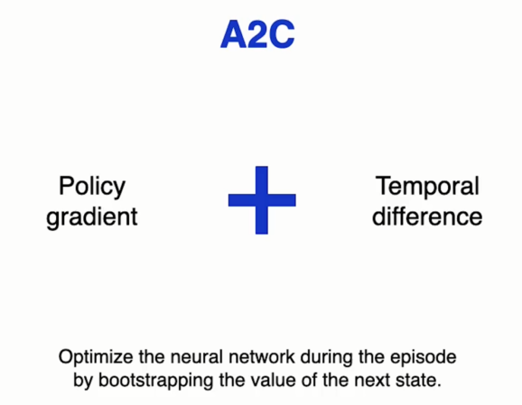

&nbsp;&nbsp;&nbsp;In order to understand how this algorithm works, We are going to need to know about the advantage function. This function measures the excess return that the agent gets when it chooses a particular action in the current state instead of letting the policy choose it. Recall that the q-value of an action is the return that we get if we take that action and then we follow the policy. On the other hand, the value of a state is the return that we get if we follow the policy from this point on. So the advantage function is the difference between the q-value of an action and the value of a state. It tells us the extra return that this action gets above the return of the policy. Or below if the value is negative. 

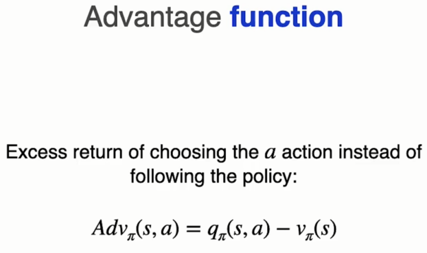

&nbsp;&nbsp;&nbsp;Recall that the value of a state can also be written as the sum for each action of its probability following a certain policy times its value. But in this way, the advantage measures how the return obtain would change if we raise the probability of taking an action to 100 percent.

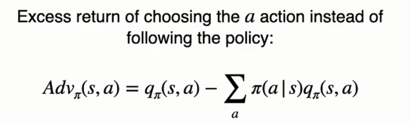

&nbsp;&nbsp;&nbsp;And how can we interpret the value of the advantage function?  
Well, if the value is positive, it means that taking action a is better than simply following the policy. And if its value is negative, taking action a is worse than following the policy.

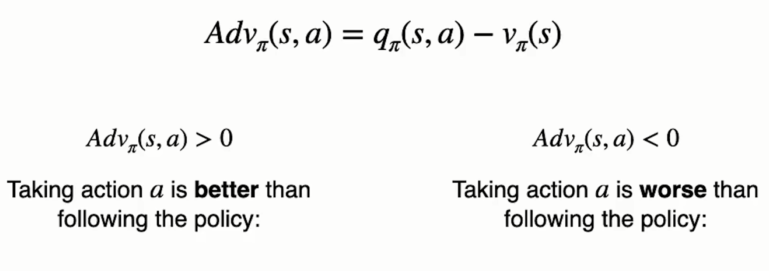

&nbsp;&nbsp;&nbsp;In order to optimize the policy, we want to reinforce the actions that get better results and disincentivize those that get worse results.

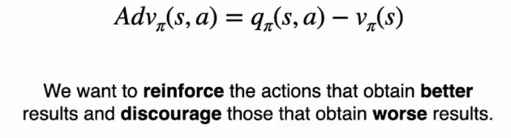

&nbsp;&nbsp;&nbsp;Note, however, that to compute the advantage function we need to know the q-values and the state values two quantities that the agent doesn't have access to while learning. What we can do is estimate the advantage with values that the agent has access to, such as experience samples collected from the environment or estimates of those values.

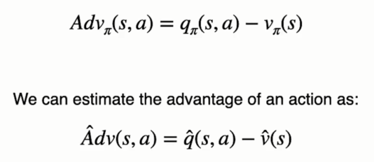

&nbsp;&nbsp;&nbsp;Specifically, we can estimate the advantage the way you see here as the reward obtained by taking an action in that state, plus an estimate of the value of the next state reached, minus the estimate of the value of the current state. The reward is a sample that we collect from the environment and the estimated values we can obtain them using a neural network.

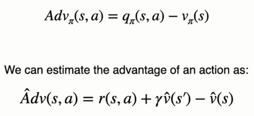

&nbsp;&nbsp;&nbsp;And then we'll replace the return used in the REINFORCE update rule by the estimate of the advantage function. But why do we want to do that. To explain it  
Imagine this control task over here. It is a 6-cell platform on which the agent can move forward or backward. Its starting point is this one here. In these 5 cells. The agent steps on Embers, and each instant in time spent in these cells generates a negative reward of negative one. When the agent reaches the green cell, the episode concludes. Here, obviously, the correct action is to go backwards because the episode is immediately over and the return of the episode is only negative one. However, the REINFORCE algorithm would use the negative return to discourage the agent from moving backwards. Of course, in the remaining states, it would get even worse results and that would make it choose to go back eventually. However, the agent is going to take longer to reach that epiphany.

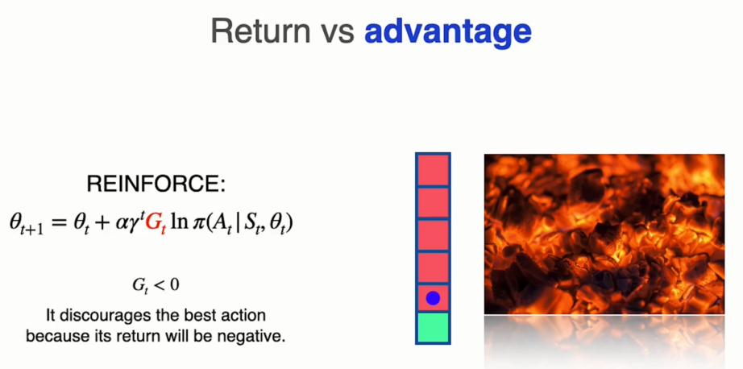

&nbsp;&nbsp;&nbsp;When we substitute the return for the estimated advantage, the agent will come to the conclusion that moving back is a good idea much sooner The agent will compare the value of moving backward with the value of the state that it's in. And the value of the advantage will be positive, thus incentivizing the actor to move backward. That is, in a bad state the advantage helps the agent understand which action is the lesser evil and helps it to reinforce that action. It also allows it to see which action is the worst in a very good state. And disincentivize it, by contrast, that using the return, the agent was not able to make these distinctions. If an action led to a negative return, that action was disincentivized, even if it was the least bad action available.

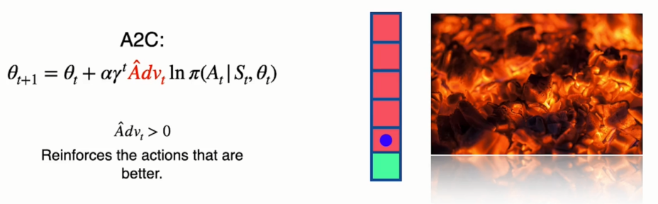

&nbsp;&nbsp;&nbsp;Now you can see why the method that we are going to implement is called A2C after Advantage Actor-Critic. Advantage, obviously, because we are going to use the advantage function to guide the optimization of the policy. Actor because it will use a neural network that will act on the environment, that is the policy. And Critic, because we are going to use a neural network that is going to estimate the values of the state and we are going to use it to refine the estimation of the advantage.

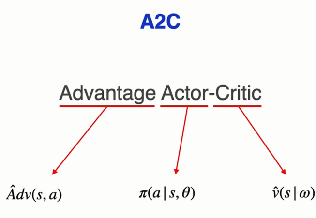

&nbsp;&nbsp;&nbsp;The update rule for this algorithm is the one you see here where we have replaced the return by the estimated advantage, we will calculate the estimated advantage using the formula below. That is the temporal difference error a time t.

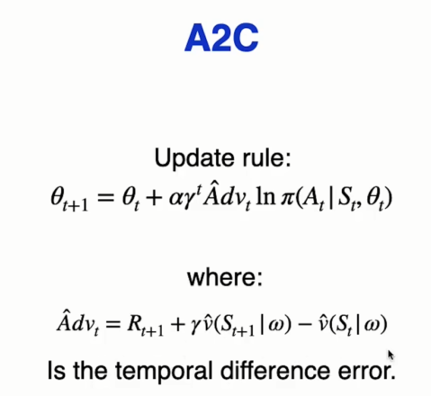

&nbsp;&nbsp;&nbsp;In this estimate of the advantage, this term will act as a baseline, eliminating the effect of the state that we're in. If we are in a good state, we will subtract the return due to the state from the return achieved by a specific action, because we want to evaluate only the merit of that action and not of the state.

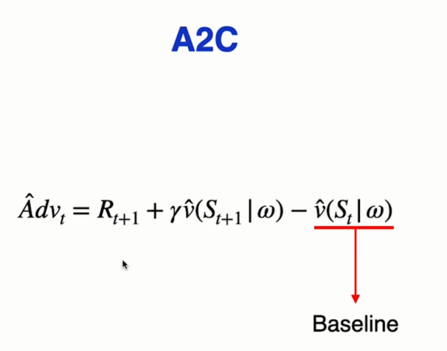

&nbsp;&nbsp;&nbsp;And this estimate here is the bootstrap value. This value replaces the rest of the rewards that we expect to get starting from the next state. And thanks to this estimate, we don't have to wait until the end of the episode to be able to update the neural network. In fact, we will be able to update it incrementally right after performing each action.

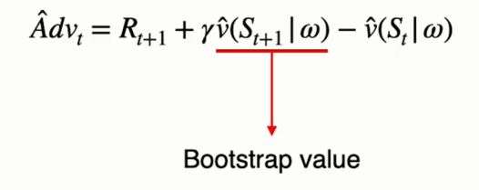

&nbsp;&nbsp;&nbsp;The REINFORCE method used the true returns obtained by the agent to improve the policy. The value of these returns depends on the path taken by the agent, which will be very variable. Therefore, the estimate of policy performance is unbiased, but it will have high variance. And we will need many samples to optimize the policy. On the other hand, the Advantage Actor-Critic algorithm by replacing future rewards with an estimate reduces the variance greatly at the cost of introducing some bias in the estimate.

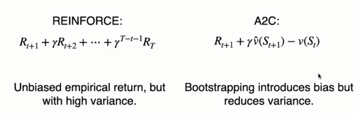

&nbsp;&nbsp;&nbsp;The way to see algorithm offers us some advantages over REINFORCE. The first one is that the reduction in variance helps to accelerate the learning process. The second benefit is that learning occurs during the episode so that the experience gained at the beginning of the episode can be used to improve the decision making for the rest of the episode.

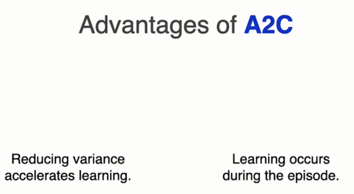

&nbsp;&nbsp;&nbsp;As in the previous method, we'll also have the agent face different environments in parallel so that it collects independent experience trajectories.

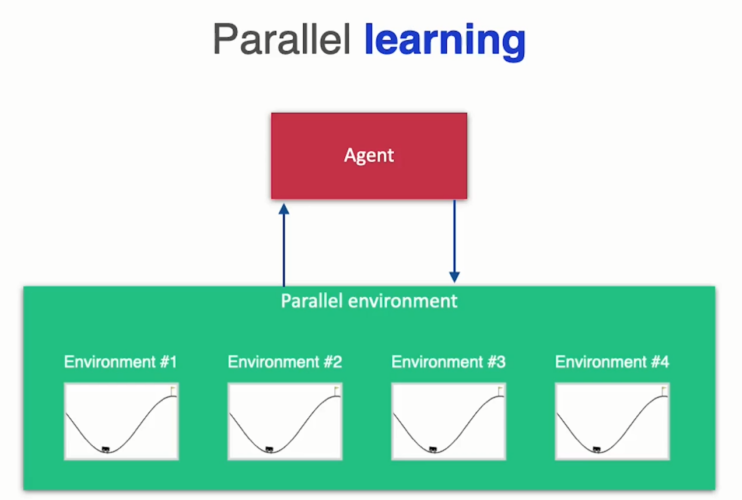

&nbsp;&nbsp;&nbsp;And also, as with REINFORCE, we will try to keep the entropy of the policy high so that it explores the environment for a longer time.

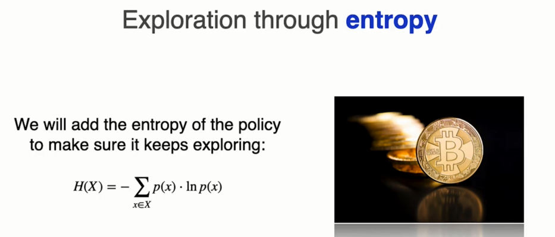

&nbsp;&nbsp;&nbsp;This is the algorithm. The structure is similar to that of REINFORCE. Let's look at it in chunks. At the beginning of the algorithm we will initialize the parallel environment, the policy network and the neural network that will estimate the values of the states.

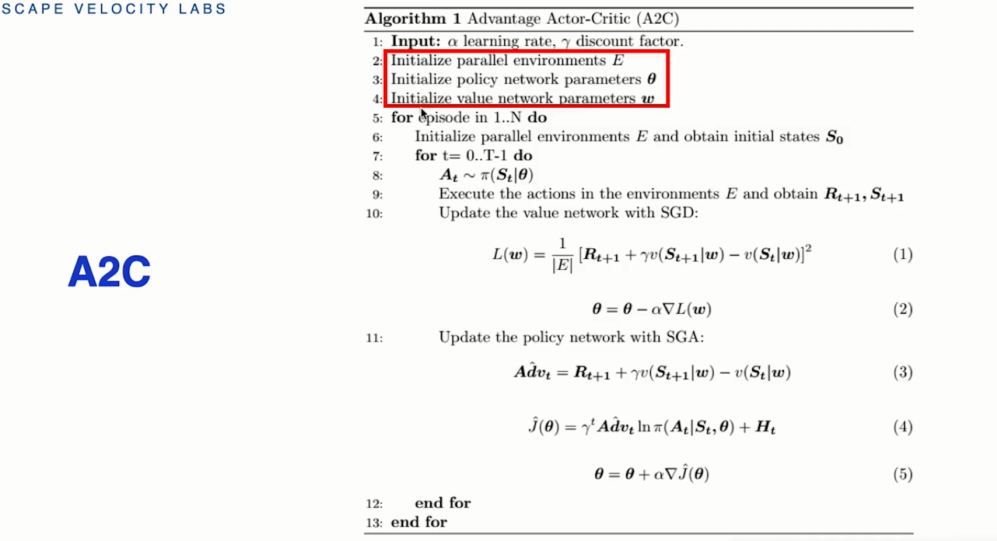

&nbsp;&nbsp;&nbsp;Then we'll enter the main loop  
which will run for a given number of episodes. At each point in time during the episode, we will perform an action and will get the associated reward and the next state.

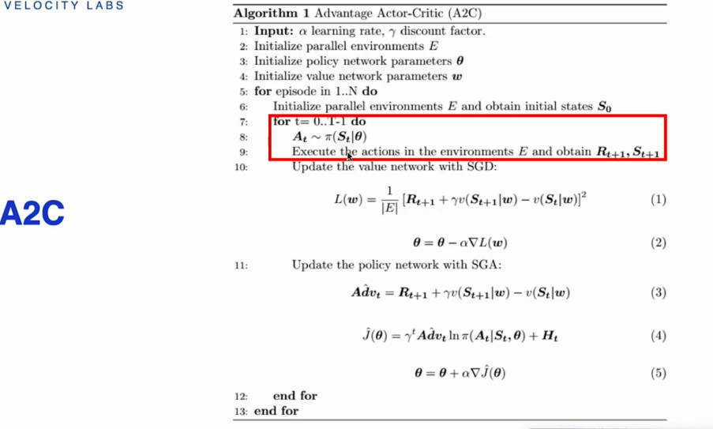

&nbsp;&nbsp;&nbsp;Then we will improve the estimate of the state values by performing a gradient descent step. The cost function to be minimized will be the mean squared error between the current state estimate and its target, which consist of the reward obtained taking an action in that state, plus the discounted estimate of the next state. As you can see, it looks the same as in the deep learning algorithm only for the value of states instead of the q-values.

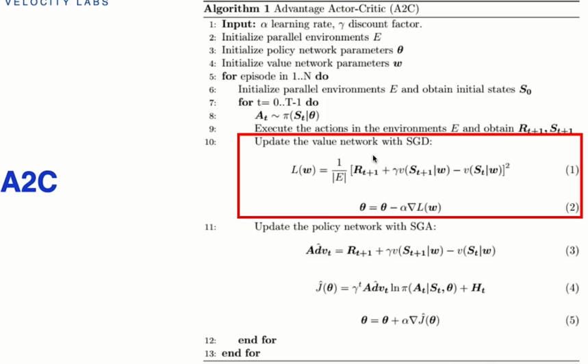

&nbsp;&nbsp;&nbsp;Finally we will perform a gradient descent step to improve the policy. To do this will estimate the value of the advantage function and we will use it to estimate the performance of the policy, which we will then use in the update rule.

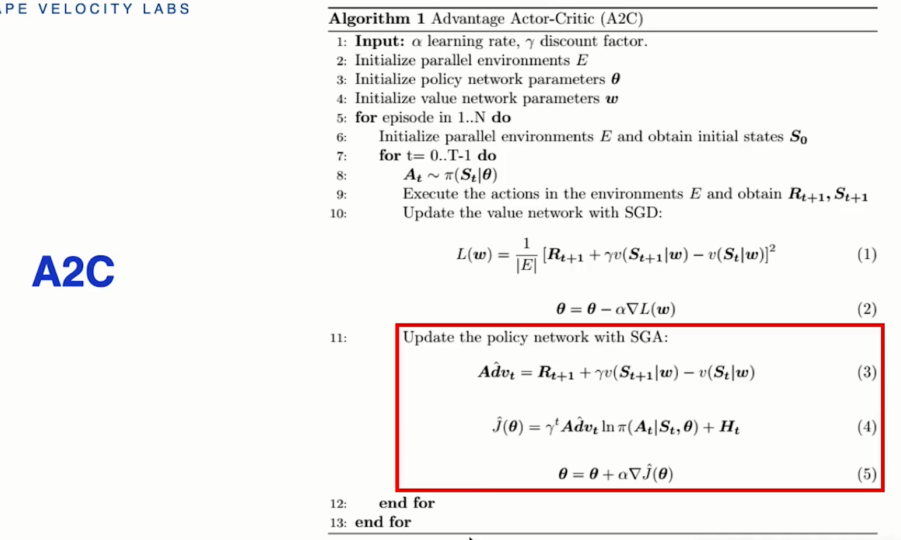

https://colab.research.google.com/github/escape-velocity-labs/beginner_master_rl/blob/main/Section_11_advantage_actor_critic_complete.ipynb#scrollTo=67rhCAvE7vV4

