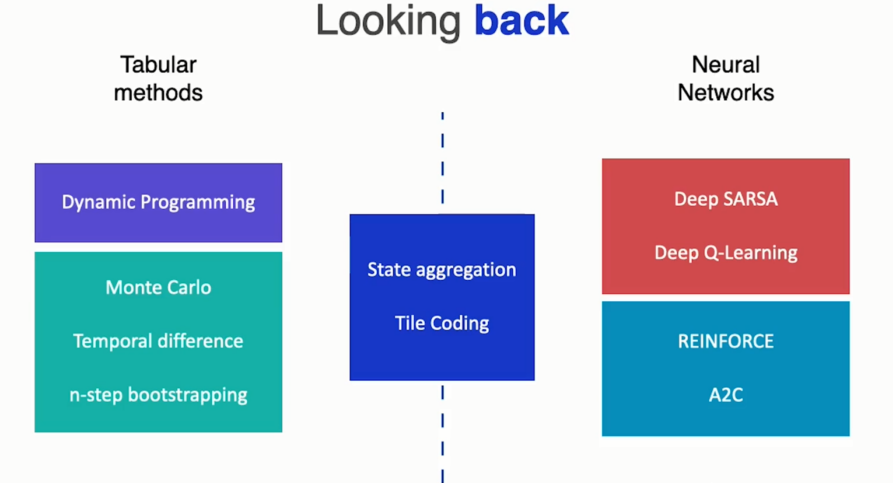

# Looking back

&nbsp;&nbsp;&nbsp;I want you to look back and see how far you've come. We started by learning how to model very diverse, control tasks with a single tool, the Markov decision process. Through it, we learned the difference between the agent and the environment. We also saw the difference between a reward and the return of an episode. And we learn how to express the agent's decision-making through its policy, and based on that policy we defined the value function of the states and the q-value function. Then we looked at the Bellman equations and how they can be used to produce increasingly precise estimates of the value function.

